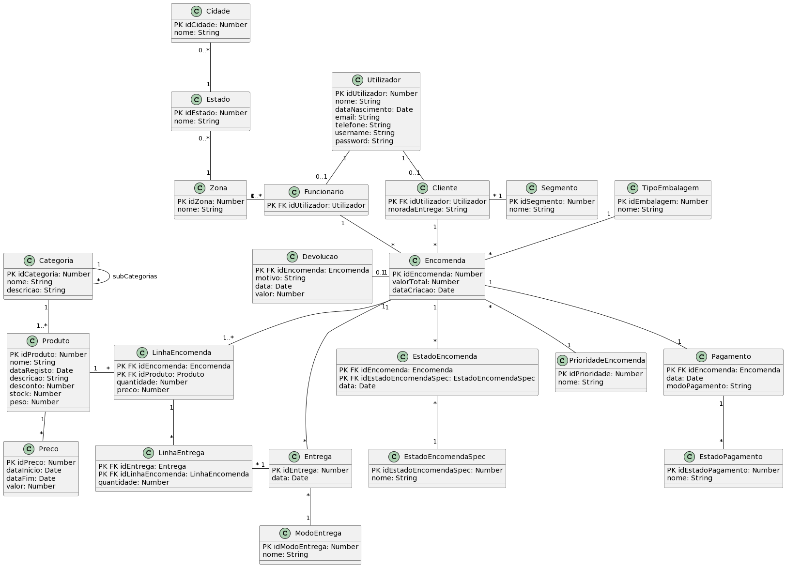

# Sistemas de Informação para Gestão

## Introdução
Repositório destinado aos Diagramas de Classes assim como ao código referente ao projeto [*TypeScript*](https://www.typescriptlang.org/), que através do [*MikroORM*](https://mikro-orm.io/), permite gerar entidades e aplicar migrações a uma base de dados, que no caso do projeto é [*MySQL*](https://www.mysql.com/).

## Diagrama de Classes
Ver [class-diagram.puml](class-diagram.puml) para o diagrama de classes em formato [*PlantUML*](https://plantuml.com/).

Versão em imagem:

## Derivação para o esquema relacional
Ver [derivacao-relacional.md](derivacao-relacional.md).

## Autoria

- [Lucas Pinto](https://github.com/luckspt) 59903
- [Rómulo Nogueira](https://github.com/RomuloNogueira02) 59908