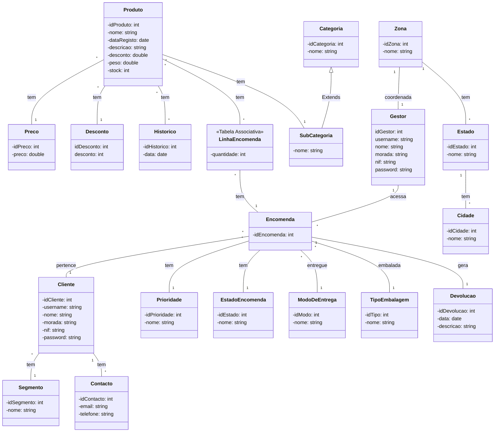

```mermaid

classDiagram

    Produto "*" -- "1" Preco : tem
    Produto "*" -- "1" Desconto : tem
    Produto "*" -- "*" Historico : tem


    Produto "*" -- "*" LinhaEncomenda : tem
    LinhaEncomenda "*" -- "1" Encomenda : tem

    Encomenda "*" -- "1" Cliente : pertence
    Encomenda "*" -- "1" Prioridade : tem
    Encomenda "*" -- "1" EstadoEncomenda : tem
    Encomenda "*" -- "1" ModoDeEntrega : entregue
    Encomenda "*" -- "1" TipoEmbalagem : embalada
    Encomenda "1" -- "1" Devolucao : gera

    Produto "*" -- "1" SubCategoria : tem
    Categoria <|-- SubCategoria : Extends

    Cliente "*" -- "1" Segmento : tem
    Cliente "1" -- "*" Contacto : tem

    Zona "1" -- "1" Gestor : coordenada
    Zona "1" -- "*" Estado : tem
    Estado "1" -- "*" Cidade : tem

    Gestor "1" -- "*" Encomenda : acessa


    class Produto{
        -idProduto: int
        -nome: string
        -dataRegisto: date
        -descricao: string
        -desconto: double
        -peso: double
        -stock: int
    }

    class Preco{
        -idPreco: int
        -preco: double
    }

    class Desconto{
        idDesconto: int
        desconto: int 
    }

    class Categoria{
        -idCategoria: int
        -nome: string
    }

    class SubCategoria{
        -nome: string
    }

    class Historico{
        -idHistorico: int
        -data: date
    }

    class Cliente{
        -idCliente: int
        -username: string
        -nome: string
        -morada: string
        -nif: string
        -password: string
    }

    class Segmento{
        -idSegmento: int
        -nome: string
    }

    class Contacto{
        -idContacto: int
        -email: string
        -telefone: string
    }

    class Encomenda{
        -idEncomenda: int
    }

    class LinhaEncomenda{
        <<Tabela Associativa>>
        -quantidade: int
    }

    class Prioridade{
        -idPrioridade: int
        -nome: string
    }

    class EstadoEncomenda{
        -idEstado: int
        -nome: string
    }

    class Zona{
        -idZona: int
        -nome: string
    }

    class Estado{
        -idEstado: int
        -nome: string
    }

    class Cidade{
        -idCidade: int
        -nome: string
    }

    class Gestor{
        idGestor: int
        username: string
        nome: string
        morada: string
        nif: string
        password: string
    }

    class ModoDeEntrega{
        -idModo: int
        -nome: string
    }

    class TipoEmbalagem{
        -idTipo: int
        -nome: string
    }

    class Devolucao{
        -idDevolucao: int
        -data: date
        -descricao: string
    }

```